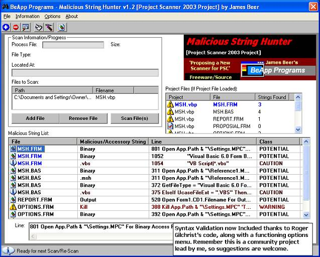



## Malicious String Hunter v1\.2 \- Stage 2 on \[Project Scanner 2003\] Project

### Description

Malicious String Hunter Now has Syntax/Context

Validation Included! thanks to Roger Gilchrist.

This is a small update with Options now working

allowing you to:

* select what type of Log to Create

* the ability to Exclude both low class strings

in search.

This Project is still continuing, So suggestions

are welcomed!

Please Vote and Leave feedback on the new feature.
 
### More Info
 

             |
---                |---
**Submitted On**   |2003-01-02 16:14:32
**By**             |[James Beer](https://github.com/Planet-Source-Code/PSCIndex/blob/master/ByAuthor/james-beer.md)
**Level**          |Intermediate
**User Rating**    |4.9 (44 globes from 9 users)
**Compatibility**  |VB 6\.0
**Category**       |[Complete Applications](https://github.com/Planet-Source-Code/PSCIndex/blob/master/ByCategory/complete-applications__1-27.md)
**World**          |[Visual Basic](https://github.com/Planet-Source-Code/PSCIndex/blob/master/ByWorld/visual-basic.md)
**Archive File**   |[Malicious\_152266122003\.zip](https://github.com/Planet-Source-Code/james-beer-malicious-string-hunter-v1-2-stage-2-on-project-scanner-2003-project__1-42112/archive/master.zip)

